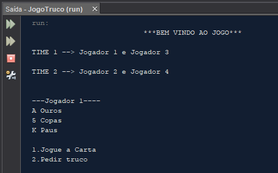

     

# Truco

Este repositório é um trabalho acadêmico desenvolvido em Java para simular o jogo do truco.

# Screenshot

# Licença

Este projeto está sob licença [MIT](https://choosealicense.com/licenses/mit/) © 2020 Adriana Cardoso. 

Para mais informações acesse o arquivo :scroll:`LICENSE.md`.

# Contato

**Adriana Cardoso**  
Desenvolvedora Java | Spring Boot | Angular 
- 📧 adrianamirianmc@gmail.com
